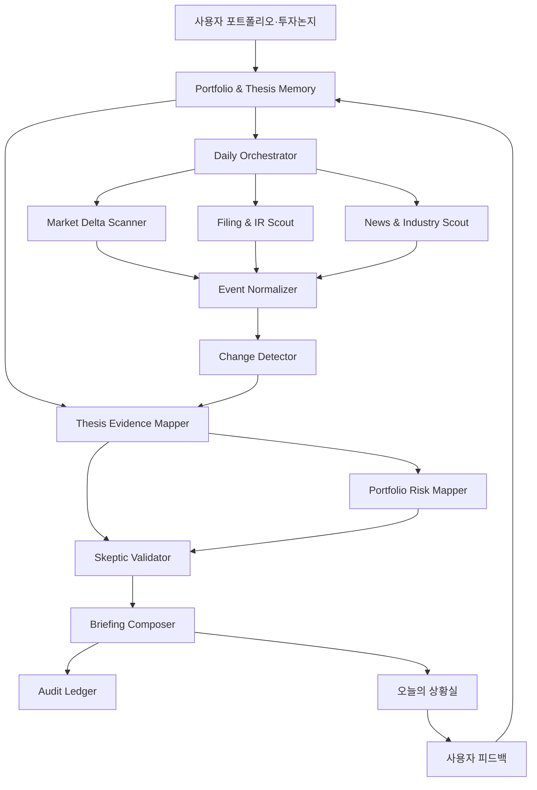

# ThesisGuard — AAA급 제품·에이전트 설계서

> **부제:** 오늘 주가가 아니라, 내가 산 이유가 달라졌는지를 추적한다.

- **문서 버전:** v1.0
- **작성 기준일:** 2026-08-23
- **문서 상태:** 제품 방향 확정 · 구현계획 작성 전 사용자 검토 대기
- **공모전:** MABC 2026
- **예선 제출 스킬명:** `Thesis Change Detector — 오늘 내 투자논지에서 달라진 것`
- **결선 서비스명:** `ThesisGuard — 내 종목 상황실`
- **문서 역할:** 제품 기획, 에이전트 동작, 안전 기준, 평가 기준의 단일 기준 문서

---

## 0. 이 문서를 사용하는 방법

이 문서는 ThesisGuard의 기능을 많이 나열한 아이디어 문서가 아니다. 팀이 개발·데모·One Pager·발표자료를 만들 때 판단이 갈리면 가장 먼저 확인하는 **제품 기준 문서**다.

우선순위는 다음과 같다.

1. 본 문서에서 확정한 핵심 문제와 사용자 약속
2. 예선 단일 스킬의 입력·처리·출력 계약
3. 증거·신뢰·안전 규칙
4. 결선 MVP 범위
5. 이후 구현계획과 세부 기술 선택

기술적으로 가능하더라도 본 문서의 핵심 범위를 흐리는 기능은 초기 버전에 넣지 않는다.

---

# 1. 최종 제품 결정

## 1.1 무엇을 만드는가

ThesisGuard는 사용자가 종목을 **왜 보유하거나 관심 있게 보는지** 기억하고, 매일 시장지표·공시·기업 발표·뉴스에서 새롭게 달라진 사실을 찾아 사용자의 투자논지가 다음 중 어떤 상태인지 근거와 함께 알려주는 개인 투자 감시 에이전트다.

- 강화됨
- 유지
- 관찰 필요
- 약화됨
- 재검토 필요
- 판단 보류

핵심 산출물은 뉴스 모음이나 종목 추천이 아니라 다음이다.

> **보유·관심 종목별 투자논지 변화 보고서와 포트폴리오 공통 위험 브리핑**

## 1.2 무엇을 만들지 않는가

ThesisGuard는 다음 제품이 아니다.

- AI 종목 추천기
- 매수·매도 타이밍 신호기
- 목표가격 계산기
- 수익률 예측기
- 자동매매 시스템
- 실시간 초단타 도구
- 뉴스를 많이 모아주는 단순 요약기
- 사용자의 판단을 대신하는 로보어드바이저

## 1.3 제품의 핵심 문장

> **기존 금융 서비스가 “무슨 일이 있었는가”를 알려준다면, ThesisGuard는 “그 일이 내가 세운 투자논지에 어떤 변화를 만들었는가”를 누적해서 관리한다.**

## 1.4 핵심 슬로건

> **오늘 주가가 아니라, 내가 산 이유가 달라졌는지를 추적합니다.**

---

# 2. 공모전 전략에 맞춘 2단계 구조

MABC 2026 예선은 일상과 업무의 불편을 해결하는 단일 기능 중심의 AI 에이전트 스킬을 타임리 AI에서 구현하는 단계다. 예선에서는 Solar Open 2를 사용하고 기획 요약서 One Pager를 함께 제출한다. 결선에서는 예선 스킬을 포함해 실제 동작하는 복합 에이전트 기반 서비스 MVP로 확장한다.

따라서 처음부터 거대한 투자 플랫폼을 만들지 않고 다음처럼 분리한다.

## 2.1 예선: 단일 스킬

### Thesis Change Detector

사용자가 제공한 다음 자료를 분석한다.

- 보유·관심 종목 목록
- 종목별 투자논지 카드
- 이전 논지 상태
- 오늘의 시장지표 자료
- 오늘의 공시·기업 발표·뉴스 자료

그리고 다음 한 가지 일을 매우 안정적으로 수행한다.

> **오늘 새롭게 달라진 정보만 골라 투자논지별 강화·약화·모순을 판정하고, 근거가 연결된 개인화 브리핑을 생성한다.**

예선에서는 자동 데이터 수집, 실시간 주가, 계좌 연동, 푸시 알림을 넣지 않는다. 시연용 입력 자료를 사용자가 붙여 넣거나 업로드하면 항상 같은 기준으로 고품질 결과가 나오는 데 집중한다.

## 2.2 결선: 서비스 MVP

### ThesisGuard — 내 종목 상황실

예선 스킬을 중심으로 다음 기능을 연결한다.

- 투자논지 온보딩 및 수정
- 매일 장 마감 후 정보 수집
- 사건 단위 중복 제거
- 논지 변화 추적
- 포트폴리오 공통 위험 탐지
- 일일 브리핑
- 증거 원장과 상태 변화 이력
- 사용자 피드백
- 투자 결정 일지

## 2.3 초기 시장 범위

### 예선

- 입력 자료 기반으로 동작하므로 시장에 종속되지 않는다.
- 공식 데모는 한국 상장주식 사례를 사용한다.

### 결선 MVP

- **보유·관심 자산:** KRX·KOSDAQ 상장 보통주
- **시장 환경 지표:** 한국 시장과 주요 글로벌 지수·금리·환율·원자재
- **제외:** 미국 개별주식, ETF, 펀드, 채권, 파생상품, 가상자산

제품 구조는 향후 다른 시장으로 확장할 수 있게 설계하되, 결선에서 데이터 품질과 시연 안정성을 위해 범위를 한국 상장주식으로 고정한다.

## 2.4 브리핑 주기

- 기본 브리핑: 한국 장 마감 후 1회
- 실적·공시 긴급 알림: 결선 이후 확장 기능
- 실시간 가격 감시: 초기 범위 제외

---

# 3. 해결하려는 실제 문제

## 3.1 문제 정의

중기·장기 개인투자자는 매일 다음 일을 반복한다.

1. 보유종목 가격을 확인한다.
2. 종목별 뉴스를 검색한다.
3. 공시와 기업 발표를 확인한다.
4. 금리·환율·지수·업종 흐름을 확인한다.
5. 여러 기사가 같은 사건인지 구분한다.
6. 그 정보가 내 종목에 중요한지 판단한다.
7. 원래 매수 이유가 유지되는지 생각한다.
8. 내일 확인할 이벤트를 메모한다.

문제는 정보가 부족한 것이 아니라 **너무 많고, 중복되고, 맥락 없이 흩어져 있다는 것**이다.

## 3.2 사용자가 겪는 대표적인 실패

### 정보 과부하

같은 기업 발표를 여러 언론사가 반복 보도해 기사 20개를 읽어도 새로운 사실은 1~2개뿐이다.

### 중요도 오판

자극적인 기사 제목은 크게 받아들이지만, 투자논지에 직접 영향을 주는 평범한 공시나 수치 변화는 놓친다.

### 투자논지 망각

시간이 지나면서 처음 매수한 이유보다 당일 등락과 커뮤니티 반응에 더 크게 흔들린다.

### 인과관계 착각

주가와 뉴스가 같은 날 발생했다는 이유만으로 특정 뉴스가 상승·하락의 원인이라고 믿는다.

### 분산 착각

여러 종목을 보유해도 실제로는 모두 반도체 업황, AI 설비투자, 금리 같은 동일 위험요인에 노출될 수 있다.

### 기록 부재

과거에 왜 판단을 바꿨는지, 당시 어떤 증거가 있었는지, 에이전트의 경고가 맞았는지 추적하기 어렵다.

---

# 4. 목표 사용자와 제외 사용자

## 4.1 1차 목표 사용자

다음 특성을 가진 개인투자자를 핵심 타깃으로 한다.

- 보유종목 3~15개
- 관심종목 3~20개
- 며칠이 아닌 수개월 이상 보유를 고려함
- 매일 20~60분 정도 종목과 시장 정보를 확인함
- 종목을 산 이유는 있지만 구조화해 기록하지 않음
- 뉴스·유튜브·증권앱·공시를 여러 곳에서 확인함
- 종목 추천보다 자신의 판단을 체계적으로 관리하고 싶어 함

## 4.2 대표 페르소나

### 페르소나 A — 기록이 약한 중기 투자자

- 종목을 고를 때는 공부하지만 이후에는 당일 뉴스에 흔들림
- 투자 이유와 위험조건을 노트에 일관되게 남기지 않음
- 매일 확인 시간이 길지만 중요한 변화가 무엇인지 확신하지 못함

### 페르소나 B — 여러 테마에 분산했다고 생각하는 투자자

- 반도체 기업, AI ETF, 전력기기 기업 등 이름이 다른 자산을 보유함
- 실제로는 모두 AI 설비투자와 금리 변화에 강하게 연결됨
- 종목 수는 알고 있지만 공통 위험노출은 알기 어려움

### 페르소나 C — 관심종목이 너무 많은 투자자

- 살펴보는 종목은 많지만 무엇을 기다리고 있었는지 잊음
- 가격·실적·업황 조건이 충족되었는지 매일 직접 확인함

## 4.3 초기 제품에서 제외하는 사용자

- 스캘핑·초단타 투자자
- 실시간 호가와 초 단위 신호가 필요한 사용자
- 옵션·선물·레버리지 상품 중심 사용자
- AI가 매수·매도를 직접 결정해주길 원하는 사용자
- 자동매매가 필요한 사용자

---

# 5. 사용자에게 하는 7가지 약속

## 5.1 어제와 달라진 것부터 보여준다

기본 기업 설명과 이미 알려진 이야기를 매일 반복하지 않는다.

핵심 질문은 다음이다.

> **“이전 브리핑 이후 새롭게 확인된 사실은 무엇인가?”**

## 5.2 내 투자논지에 관련 있는 것만 우선한다

종목명만 언급된 기사보다 사용자가 등록한 핵심 가정과 위험조건에 직접 연결되는 정보를 우선한다.

## 5.3 사실·해석·미확인을 분리한다

모든 주요 항목을 다음 유형으로 표시한다.

- **사실:** 원문에서 직접 확인되는 내용
- **해석:** 사실을 바탕으로 한 영향 해석
- **미확인:** 공식 확인이 부족하거나 충돌하는 내용
- **사용자 판단:** 최종적으로 사용자가 검토할 항목

## 5.4 근거 없는 주가 원인을 만들지 않는다

주가 원인 설명은 다음 세 단계만 사용한다.

- **확인된 촉매:** 공식 발표·공시와 시장 반응의 연결이 비교적 명확함
- **가능성 높은 설명:** 복수의 신뢰 가능한 출처가 같은 설명을 제시하지만 단일 원인으로 확정할 수 없음
- **원인 불명:** 신뢰할 만한 신규 정보가 없거나 여러 원인이 혼재함

## 5.5 새로운 정보가 없으면 없다고 말한다

다음 결과는 정상적인 고품질 출력이다.

> 오늘 투자논지를 변경할 만한 새로운 증거는 확인되지 않았습니다.

## 5.6 최종 판단권은 사용자에게 남긴다

에이전트는 증거와 변화 상태를 정리하지만 매수·매도 결론을 내리지 않는다.

## 5.7 모든 상태 변화에 감사 가능한 기록을 남긴다

`유지 → 관찰 필요`처럼 상태가 바뀌면 어떤 사건과 증거가 원인이었는지 나중에 추적할 수 있어야 한다.

---

# 6. 핵심 가치 제안과 경쟁 차별화

## 6.1 기존 제품 유형과의 차이

| 기존 유형 | 주로 답하는 질문 | ThesisGuard가 추가로 답하는 질문 |
|---|---|---|
| 뉴스 수집기 | 오늘 어떤 기사가 나왔는가? | 그중 내 투자논지에 새롭게 중요한 사건은 무엇인가? |
| 포트폴리오 앱 | 오늘 얼마 올랐거나 내렸는가? | 손익을 만든 공통 위험요인과 논지 변화는 무엇인가? |
| 시장 브리핑 | 오늘 시장에서 무슨 일이 있었는가? | 그 변화가 내 보유·관심 종목의 가정과 어떻게 연결되는가? |
| 종목 스크리너 | 어떤 종목이 조건을 만족하는가? | 내가 이미 세운 판단이 여전히 유효한가? |
| 투자 추천 서비스 | 무엇을 사고팔 것인가? | 어떤 근거가 강화·약화됐으며 무엇을 재검토해야 하는가? |

## 6.2 제품의 방어력

초기의 경쟁력은 데이터 독점이 아니라 다음 누적 구조에서 나온다.

1. 사용자의 투자논지 구조
2. 핵심 가정·성공조건·훼손조건
3. 가정과 사건을 연결한 증거 원장
4. 상태 변화 타임라인
5. 사용자의 중요·무관 피드백
6. 에이전트 경고의 사후 검증 기록

이 데이터가 누적될수록 단순 뉴스 요약기보다 개인화 가치가 커진다.

## 6.3 한 문장 차별화

> **ThesisGuard는 기사를 요약하는 것이 아니라, 사용자의 판단 기준과 새로운 증거 사이의 변화를 추적한다.**

---

# 7. 전체 사용자 여정

## 7.1 포트폴리오 등록

초기 입력 방식은 다음으로 제한한다.

- 직접 입력
- 정해진 CSV 양식
- 자연어 입력

결선 MVP에서는 증권앱 캡처 인식은 보조 입력으로 제공할 수 있지만, 인식 결과를 사용자가 확인해야 저장된다. 증권사 로그인이나 계좌 API 연결은 하지 않는다.

필수 항목:

- 종목명
- 종목코드
- 보유 또는 관심 구분
- 보유 수량 또는 포트폴리오 비중
- 평균 매수가(선택)
- 등록일

## 7.2 투자논지 인터뷰

종목별 필수 질문은 5개로 고정한다.

1. 이 종목을 보유하거나 관심종목으로 등록한 핵심 이유는 무엇인가?
2. 앞으로 어떤 일이 확인되면 이 아이디어가 강화됐다고 볼 수 있는가?
3. 어떤 일이 발생하면 처음 판단을 재검토해야 하는가?
4. 예상 관찰·보유 기간은 어느 정도인가?
5. 반드시 추적하고 싶은 지표·공시·이벤트가 있는가?

에이전트는 답변을 구조화한 뒤 사용자에게 확인받는다. 사용자가 승인하기 전에는 확정 투자논지로 저장하지 않는다.

## 7.3 투자논지 카드 생성

### 예시 구조

**종목:** A반도체  
**상태:** 보유  
**관찰 기간:** 1~2년

**핵심 가정**

- AI 서버 투자가 중기적으로 증가한다.
- 고부가 메모리 수요가 공급보다 빠르게 증가한다.
- 고부가 제품 비중 상승이 수익성 개선으로 연결된다.

**강화 조건**

- 핵심 고객사의 AI 설비투자 가이던스 상향
- 고부가 제품 출하량과 수익성의 동반 개선
- 경쟁사 대비 기술 또는 공급계약 우위 확인

**재검토 조건**

- 핵심 고객사의 AI 설비투자 축소
- 고부가 제품 가이던스 연속 하향
- 재고 증가와 가격 하락의 동시 발생
- 경쟁사 진입으로 구조적 점유율 하락 확인

**추적 항목**

- 고객사 CAPEX
- 제품 출하량
- 메모리 가격
- 영업이익률
- 재고자산
- 경쟁사 인증·공급계약

## 7.4 초기 기준선 생성

첫 실행에서는 오늘 뉴스만 분석하지 않는다. 사용자의 투자논지 카드와 현재 알려진 상태를 기반으로 초기 기준선을 만든다.

- 각 핵심 가정의 현재 상태
- 이미 확인된 강화·약화 증거
- 아직 확인이 필요한 항목
- 다음 주요 이벤트
- 포트폴리오 공통 위험요인

이 기준선이 있어야 다음 브리핑부터 ‘달라진 것’을 계산할 수 있다.

## 7.5 일일 실행

1. 전일 상태를 불러온다.
2. 시장·기업 자료를 수집하거나 입력받는다.
3. 문서를 사건 단위로 통합한다.
4. 이전에 이미 처리한 사건을 제외한다.
5. 새 사건을 투자논지에 연결한다.
6. 강화·약화·모순 증거를 평가한다.
7. 상태 변경 필요성을 판단한다.
8. 포트폴리오 공통 위험을 계산한다.
9. Skeptic 검증을 통과한 항목만 브리핑한다.
10. 브리핑과 근거를 저장한다.

## 7.6 사용자 피드백

각 주요 항목에 다음 피드백을 받을 수 있다.

- 중요함
- 이미 알고 있음
- 나와 무관함
- 해석이 틀림
- 투자논지 수정

피드백은 다음 실행의 관련성 순위와 논지 카드에 반영한다. 다만 사용자의 긍정적 편향만 강화하지 않도록 반대 증거 탐지는 항상 유지한다.

## 7.7 결정 일지

사용자는 브리핑 이후 자신의 판단을 선택적으로 기록한다.

- 유지
- 추가 조사
- 논지 수정
- 비중 검토
- 매매 행동 기록
- 아무 행동 없음

에이전트는 행동을 추천하지 않으며, 사용자가 남긴 판단과 당시 증거를 연결해 기록한다.

---

# 8. 예선 단일 스킬 상세 설계

## 8.1 스킬명

### Thesis Change Detector

**한국어 표시명:** 오늘 내 투자논지에서 달라진 것

## 8.2 한 줄 설명

> 보유·관심 종목의 기존 투자논지와 오늘의 시장·기업 자료를 비교해 새롭게 달라진 증거만 선별하고, 논지 상태 변화와 다음 확인 항목을 근거와 함께 정리한다.

## 8.3 예선에서 해결하는 단 하나의 일

> **자료를 요약하는 것이 아니라, 이전 투자논지 상태와 비교하여 오늘의 의미 있는 변화만 탐지한다.**

## 8.4 권장 입력 형식

입력은 하나의 `Daily Evidence Pack`으로 구성한다.

```markdown
[PORTFOLIO]
- 종목명 / 종목코드 / 보유·관심 / 비중

[THESIS_CARDS]
- 핵심 가정
- 강화 조건
- 재검토 조건
- 추적 항목

[PREVIOUS_STATE]
- 이전 상태
- 이전까지 확인된 핵심 증거
- 마지막 브리핑 날짜

[MARKET_CONTEXT]
- 주요 지수·금리·환율·업종 변화
- 기준 시각

[TODAY_SOURCES]
- 출처명
- 발행 시각
- 제목 또는 문서 유형
- 핵심 본문·발췌
- 링크 또는 출처 식별자
```

## 8.5 필수 입력 검증

다음 중 하나라도 없으면 즉시 결론을 만들지 않는다.

- 종목 식별 정보
- 최소 1개의 핵심 투자 가정
- 이전 상태 또는 `첫 실행` 표시
- 오늘 자료의 출처와 기준 시각

누락된 경우 최대 3개의 핵심 질문만 한다. 불필요한 장문 인터뷰는 하지 않는다.

## 8.6 내부 처리 순서

### Step 1. 입력 정규화

- 종목명·종목코드 통일
- 날짜와 기준 시각 통일
- 보유·관심 구분
- 출처별 문서 식별자 생성

### Step 2. 사건 추출

각 문서에서 다음을 추출한다.

- 누가
- 무엇을
- 언제
- 어떤 수치와 조건으로
- 어떤 문서에서 발표했는가

### Step 3. 사건 중복 제거

같은 보도자료를 여러 언론사가 전재한 경우 하나의 사건으로 묶는다. 기사 수를 증거 수로 계산하지 않는다.

### Step 4. 신규성 판정

- 신규 사건
- 기존 사건의 중요한 업데이트
- 기존 내용 반복
- 오래된 기사 재노출

반복 또는 재노출은 핵심 변화에서 제외한다.

### Step 5. 투자논지 연결

각 사건을 다음 중 하나로 분류한다.

- 핵심 가정 직접 관련
- 위험조건 직접 관련
- 추적 지표 관련
- 주변 맥락만 관련
- 무관

### Step 6. 증거 방향 판정

- 강화
- 약화
- 혼합
- 중립
- 판단 불가

### Step 7. 상태 변경 후보 생성

증거의 출처 등급, 직접성, 신규성, 독립적 확인 여부를 바탕으로 상태 변경 후보를 만든다.

### Step 8. 포트폴리오 공통 위험 탐지

여러 종목이 같은 산업·금리·환율·고객·규제·테마에 노출되어 있는지 확인한다.

### Step 9. Skeptic 검증

다음 항목에 하나라도 실패하면 표현을 낮추거나 판단 보류로 전환한다.

- 출처가 실제 주장을 뒷받침하는가?
- 같은 사건을 여러 증거로 중복 계산하지 않았는가?
- 추정을 사실처럼 쓰지 않았는가?
- 반대 증거를 누락하지 않았는가?
- 주가 원인을 과도하게 단정하지 않았는가?
- 데이터 기준 시각이 일치하는가?
- 사용자의 투자논지를 임의로 바꾸지 않았는가?

### Step 10. 브리핑 생성

핵심 변화, 상태, 근거, 반대 증거, 다음 확인 항목을 정해진 형식으로 생성한다.

## 8.7 예선 출력 형식

```markdown
# 오늘의 투자논지 변화 브리핑

## 1. 오늘 한 줄

## 2. 어제와 달라진 핵심 변화
- 최대 3개

## 3. 보유종목
### 종목명 — 상태
- 확인된 사실
- 투자논지 영향
- 반대 또는 제한 증거
- 다음 확인 항목
- 근거 출처

## 4. 관심종목
### 종목명 — 상태
- 관심 조건 접근 여부
- 새롭게 달라진 항목
- 다음 확인 항목

## 5. 포트폴리오 공통 위험

## 6. 판단 보류·정보 부족

## 7. 정보 품질
- 공식 원문 수
- 신뢰 가능한 보도 수
- 중복 제거 수
- 제외한 미확인 정보 수

## 8. 안전 안내
- 본 결과는 정보 정리와 기존 투자논지 점검을 위한 것이며 매수·매도 지시가 아님
```

## 8.8 예선 출력 규칙

- 본문에 최대 3개의 핵심 변화만 둔다.
- 모든 사실 주장에 출처 식별자를 붙인다.
- 직접 인용은 필요한 최소 범위만 사용한다.
- 신규 정보가 없으면 그렇게 명시한다.
- 자료에 없는 수치·날짜·인과관계를 생성하지 않는다.
- 매수·매도·목표가·비중 추천을 출력하지 않는다.
- 미확인 소문은 상태 변경 근거로 사용하지 않는다.
- 사용자 논지와 무관한 시장 상식 설명으로 분량을 채우지 않는다.

## 8.9 예선 성공 기준

예선 스킬은 다음 조건을 모두 충족해야 제출 가능한 상태로 본다.

1. 같은 입력에 일관된 구조로 응답한다.
2. 핵심 변화와 단순 반복 정보를 구분한다.
3. 동일 사건 중복 기사를 하나로 통합한다.
4. 투자논지와 무관한 기사를 핵심 브리핑에서 제외한다.
5. 모든 중요한 사실에 출처가 연결된다.
6. 반대 증거와 정보 부족을 숨기지 않는다.
7. 금지된 투자 지시를 생성하지 않는다.
8. 새로운 정보가 없는 테스트에서 억지 결론을 만들지 않는다.
9. 3분 이내에 읽을 수 있다.
10. Solar Open 2 환경에서 복잡한 도구 없이 안정적으로 재현된다.

---

# 9. 결선 MVP 기능 범위

## 9.1 Must Have

- 사용자 계정과 기본 설정
- 보유·관심 종목 등록
- 투자논지 인터뷰와 카드 확정
- 공식·신뢰 출처 기반 자료 수집
- 사건 추출·중복 제거
- 전일 대비 변화 탐지
- 투자논지 상태 분류
- 포트폴리오 공통 위험지도
- 장 마감 후 일일 브리핑
- 출처·근거 열람
- 상태 변화 타임라인
- 사용자 피드백
- 금지 출력 필터

## 9.2 Should Have

- CSV 포트폴리오 가져오기
- 증권앱 캡처 보조 인식 및 사용자 확인
- 예정 이벤트 캘린더
- 관심종목 조건 접근 알림
- 투자 결정 일지
- 에이전트 과거 경고의 사후 검토

## 9.3 Could Have

- 모바일 푸시
- 주간 회고 브리핑
- 투자논지 템플릿
- 가족·팀 단위 공유
- 음성 브리핑

## 9.4 Won’t Have in MVP

- 자동매매
- 매수·매도 추천
- 목표가·수익률 예측
- 미국 개별주식 지원
- 가상자산·파생상품 지원
- 실시간 호가
- 초단위 뉴스 대응
- 증권사 계정 로그인
- 소셜 커뮤니티 감성만을 이용한 판단
- 복잡한 기술적 분석 신호

---

# 10. 결선 MVP 핵심 화면

## 10.1 오늘의 상황실

사용자가 앱을 열었을 때 가장 먼저 보는 화면이다.

- 오늘 한 줄
- 투자논지 상태 변화가 큰 종목
- 오늘의 핵심 변화 최대 3개
- 포트폴리오 공통 위험
- 예정 이벤트
- 데이터 기준 시각

## 10.2 종목별 투자논지

- 핵심 가정 그래프
- 강화 조건
- 재검토 조건
- 현재 상태
- 강화·약화 증거
- 반대 증거
- 상태 변화 타임라인
- 사용자의 논지 수정 기록

## 10.3 포트폴리오 위험지도

- 산업 집중
- 금리 민감도
- 환율 민감도
- 주요 고객·산업 의존
- 원자재 민감도
- 규제 노출
- 테마 중복

정밀한 금융 리스크 수치처럼 보이게 만들지 않고 `높음·중간·낮음`과 근거를 함께 표시한다.

## 10.4 관심종목 레이더

- 관심 등록 이유
- 사용자가 기다리는 조건
- 조건 접근 여부
- 새롭게 등장한 위험
- 다음 주요 이벤트
- 최근 변화 요약

## 10.5 증거 원장·결정 일지

- 브리핑 날짜
- 당시 논지 상태
- 상태 변경 근거
- 사용자의 판단
- 실제 행동 기록
- 이후 확인된 결과
- 에이전트 경고의 사후 평가

---

# 11. 논리적 에이전트 아키텍처

결선에서는 여러 논리적 역할을 분리한다. 실제 배포에서 반드시 각각 별도 LLM 에이전트 프로세스일 필요는 없다. 안정성과 비용을 위해 규칙 기반 처리, 검색, LLM 판단을 혼합한다.



## 11.1 Daily Orchestrator

- 실행 시각과 대상 종목 결정
- 수집·분석 단계 순서 제어
- 실패 재시도
- 데이터 기준 시각 고정
- 누락된 데이터 표시
- 최종 브리핑 생성 여부 결정

## 11.2 Portfolio & Thesis Memory

- 보유·관심 종목
- 비중과 평균 매수가
- 핵심 가정
- 강화·재검토 조건
- 추적 항목
- 이전 상태
- 사용자 피드백
- 결정 일지

## 11.3 Market Delta Scanner

절대값보다 변화에 집중한다.

- 전일 대비
- 최근 5거래일 대비
- 최근 20거래일 기준 대비
- 평소 범위를 벗어난 변화
- 사용자 포트폴리오와 관련된 거시 변수

## 11.4 Filing & IR Scout

공식 원문을 최우선으로 수집한다.

- 정기·수시 공시
- 기업 IR
- 실적 발표
- 가이던스
- 주요 계약
- 설비투자
- 자본조달
- 소송·규제
- 지배구조 변화

## 11.5 News & Industry Scout

- 기업 뉴스
- 산업 데이터
- 주요 고객·경쟁사 발표
- 정책·규제 변화
- 신뢰 가능한 언론 보도

목표는 많은 기사를 수집하는 것이 아니라 **후보 사건을 발견하는 것**이다.

## 11.6 Event Normalizer

- 동일 사건 기사 묶기
- 최초·원문 출처 확인
- 날짜·수치·통화 단위 통일
- 후속 보도를 기존 사건에 연결
- 오래된 기사 재노출 식별
- 종목·기업명 엔터티 통일

## 11.7 Change Detector

- 이전 브리핑 이후 신규 여부
- 수치 변화 여부
- 기존 사건의 중요한 업데이트 여부
- 단순 반복·재전송 여부

## 11.8 Thesis Evidence Mapper

제품의 핵심 추론 모듈이다.

각 사건을 다음에 연결한다.

- 핵심 가정
- 강화 조건
- 재검토 조건
- 추적 지표
- 주변 맥락

그리고 방향, 직접성, 영향 기간, 증거 품질을 판정한다.

## 11.9 Portfolio Risk Mapper

개별 종목 분석을 다음 공통 위험요인으로 합친다.

- 산업
- 금리
- 환율
- 원자재
- 주요 고객
- 공급망
- 국가·지역
- 규제
- 동일 성장 테마
- 시장 베타

## 11.10 Skeptic Validator

다른 모듈의 결과를 의도적으로 반박한다.

- 주장을 뒷받침하지 않는 출처 제거
- 단순 동시 발생을 인과로 표현한 문장 수정
- 중복 사건 증거 수 조정
- 반대 증거 누락 탐지
- 과도한 상태 변경 취소
- 데이터 시점 충돌 탐지
- 금지된 투자 권유 표현 차단

## 11.11 Briefing Composer

- 3분 이내 읽기
- 핵심 변화 최대 3개
- 상세 근거는 펼쳐보기
- 사실·해석·미확인 분리
- 정보가 없으면 없다고 출력

## 11.12 Audit Ledger

- 어떤 입력이 사용됐는가
- 어떤 사건이 생성됐는가
- 어떤 사건이 제외됐는가
- 어떤 논지에 연결됐는가
- 왜 상태가 변경됐는가
- 어떤 검증 규칙을 통과했는가

---

# 12. 핵심 데이터 모델

## 12.1 User

- user_id
- 기본 시간대
- 기본 브리핑 시각
- 투자정보 표시 선호
- 위험 안내 동의 상태

## 12.2 Position

- position_id
- user_id
- 종목코드
- 종목명
- 시장
- 보유·관심 구분
- 수량
- 평균 매수가
- 비중
- 등록일
- 활성 상태

## 12.3 Thesis

- thesis_id
- position_id
- 논지 요약
- 관찰 기간
- 현재 상태
- 사용자 승인 버전
- 마지막 수정일

## 12.4 Thesis Claim

- claim_id
- thesis_id
- 핵심 가정 문장
- 중요도: 핵심·보조
- 예상 확인 기간
- 활성 상태

## 12.5 Trigger

- trigger_id
- thesis_id
- 유형: 강화·재검토
- 조건 문장
- 필요한 확인 방식
- 충족 상태

## 12.6 Tracked Indicator

- indicator_id
- thesis_id
- 지표명
- 방향성
- 확인 주기
- 출처 유형

## 12.7 Source Document

- source_id
- 출처명
- 원문 URL 또는 식별자
- 문서 유형
- 발행 시각
- 수집 시각
- 기준 시각
- 출처 등급
- 원문 해시

## 12.8 Event

- event_id
- 사건 유형
- 관련 기업·산업
- 발생 시각
- 최초 출처
- 핵심 사실
- 신규성
- 공식 확인 수준
- 중복 문서 목록

## 12.9 Evidence Link

- evidence_id
- event_id
- claim_id 또는 trigger_id
- 방향: 강화·약화·혼합·중립
- 직접성: 직접·간접
- 영향 기간: 단기·중기·장기
- 증거 품질
- 근거 문장 위치
- 반대 증거 연결

## 12.10 Thesis State Snapshot

- snapshot_id
- thesis_id
- 기준 날짜
- 이전 상태
- 새 상태
- 변경 이유
- 사용된 증거
- 반대 증거
- 판단 확신 수준
- 사용자 검토 여부

## 12.11 Briefing

- briefing_id
- user_id
- 기준 시각
- 핵심 변화
- 종목별 결과
- 공통 위험
- 판단 보류
- 정보 품질 지표
- 생성 버전

## 12.12 Feedback

- feedback_id
- 사용자
- 대상 사건·브리핑·상태
- 중요함·이미 앎·무관·해석 오류·논지 수정
- 자유 메모
- 반영 여부

## 12.13 Decision Journal

- journal_id
- 사용자
- 브리핑
- 당시 상태
- 사용자의 판단
- 실제 행동
- 메모
- 사후 검토

---

# 13. 증거·출처 신뢰 체계

## 13.1 출처 등급

### Tier A — 공식 원문

- 전자공시
- 기업 IR·실적자료
- 거래소·정부·중앙은행·통계기관
- 법령·규제기관 발표

핵심 상태 변경의 최우선 근거다.

### Tier B — 신뢰도 높은 2차 출처

- 편집·검증 체계를 갖춘 주요 언론
- 공식 인터뷰를 정확히 인용한 보도
- 공신력 있는 산업기관 보고서

### Tier C — 전문 분석·추정

- 증권사·리서치기관 분석
- 전문가 해설
- 산업 추정 데이터

사실과 분석을 분리해 사용하며, 단독으로 강한 상태 변경을 만들지 않는다.

### Tier D — 미확인·소셜·커뮤니티

- 익명 게시물
- 출처 불명 루머
- 원문 확인이 어려운 재가공 콘텐츠

핵심 브리핑과 상태 변경 근거에서 제외한다. 필요하면 `미확인 동향`에만 별도 표시한다.

## 13.2 증거 평가 축

숫자 하나의 가짜 정밀도 대신 다음 범주를 함께 저장한다.

- **출처 권위:** A·B·C·D
- **직접성:** 핵심 가정에 직접·간접
- **신규성:** 신규·업데이트·반복·재노출
- **확인 수준:** 공식·복수 확인·단일 출처·미확인
- **영향 기간:** 단기·중기·장기
- **방향:** 강화·약화·혼합·중립

## 13.3 중복 제거 원칙

- 같은 보도자료를 전재한 기사 수는 독립 증거 수가 아니다.
- 최초 원문이 있으면 원문을 대표 출처로 사용한다.
- 후속 기사에 새로운 수치나 확인 사실이 있을 때만 별도 업데이트로 인정한다.
- 제목이 달라도 핵심 사건·수치·발표 주체가 같으면 하나로 묶는다.

## 13.4 시간 기준

모든 브리핑은 다음 시각을 명시한다.

- 시장 데이터 기준 시각
- 문서 발행 시각
- 문서 수집 시각
- 브리핑 생성 시각

시점이 다른 수치를 직접 비교할 경우 차이를 표시한다.

## 13.5 외부 문서 안전

공시·뉴스·사용자 업로드 문서의 본문은 **데이터**로 취급한다. 문서 안에 포함된 지시문이나 프롬프트 형태의 문장은 에이전트 명령으로 실행하지 않는다.

---

# 14. 투자논지 상태 체계와 전환 규칙

## 14.1 상태 정의

| 상태 | 의미 |
|---|---|
| **강화됨** | 핵심 가정을 뒷받침하는 신뢰도 높은 신규 증거가 확인됨 |
| **유지** | 기존 판단을 바꿀 만큼 중요한 신규 증거가 없음 |
| **관찰 필요** | 위험 신호가 생겼지만 핵심 가정 변경 수준은 아님 |
| **약화됨** | 핵심 가정에 반하는 신뢰도 높은 증거가 누적되거나 직접 확인됨 |
| **재검토 필요** | 사용자가 정한 재검토 조건이 충족되었거나 핵심 가정의 전제가 크게 훼손될 가능성이 큼 |
| **판단 보류** | 증거가 충돌하거나 자료 품질·시점이 부족해 상태를 정하기 어려움 |

## 14.2 기본 전환 원칙

- 단일 자극적 기사만으로 `약화됨` 또는 `재검토 필요`로 변경하지 않는다.
- Tier D 정보는 상태 전환에 사용하지 않는다.
- 간접적 거시 변화는 기본적으로 `관찰 필요` 이하의 영향만 준다.
- 직접적인 Tier A 사건이 사용자의 명시적 재검토 조건을 충족하면 `재검토 필요`로 바로 전환할 수 있다.
- 서로 충돌하는 강한 증거가 있으면 `판단 보류`를 우선한다.
- 중요한 신규 증거가 없으면 `유지`한다.
- 일반적으로 하루에 한 단계 이상 급격하게 상태를 바꾸지 않는다.

## 14.3 강화됨 조건

다음 중 하나를 충족하고 더 강한 반대 증거가 없을 때 고려한다.

- Tier A의 직접적인 신규 증거가 핵심 가정을 뒷받침함
- 서로 독립적인 Tier A·B 증거가 같은 방향을 뒷받침함
- 사용자가 정한 강화 조건이 공식 자료로 충족됨

## 14.4 관찰 필요 조건

- 핵심 위험요인과 관련된 초기 신호가 발생함
- 거시·산업 환경이 불리하게 변했지만 기업 고유 논지는 아직 유지됨
- 신뢰도는 있으나 직접성이 낮은 부정적 증거가 등장함

## 14.5 약화됨 조건

- 핵심 가정에 반하는 Tier A·B 직접 증거가 확인됨
- 같은 방향의 부정적 증거가 여러 날짜에 걸쳐 누적됨
- 강화 조건의 반대 상황이 공식 수치로 확인됨

## 14.6 재검토 필요 조건

- 사용자가 명시한 재검토 조건이 충족됨
- 핵심 가정의 전제가 공식적으로 크게 변경됨
- 논지 카드 자체가 현재 상황을 설명하지 못할 정도로 오래되거나 부정확함

`재검토 필요`는 매도 신호가 아니다. 사용자가 원래 논지를 다시 확인해야 한다는 의미다.

## 14.7 판단 보류 조건

- 공식 원문과 보도가 충돌함
- 서로 독립적인 강한 증거가 반대 방향을 가리킴
- 문서의 날짜·대상·단위가 불명확함
- 중요한 자료가 누락됨

---

# 15. 포트폴리오 공통 위험지도

## 15.1 목적

종목 수가 많아도 같은 위험요인에 노출되어 있다면 실질적인 분산이 아닐 수 있다. 이 기능은 개별 종목 뉴스보다 한 단계 높은 포트폴리오 관점을 제공한다.

## 15.2 초기 위험요인 분류

- 산업·업종
- 성장 테마
- 장기금리
- 원/달러 환율
- 주요 원자재
- 특정 고객사·고객 산업
- 특정 국가·지역
- 공급망
- 정책·규제
- 시장 전체 위험선호

## 15.3 표시 방식

각 위험요인에 대해 다음을 제공한다.

- 노출 종목 수
- 포트폴리오 비중
- 노출 수준: 높음·중간·낮음
- 판단 근거
- 오늘의 변화

정교한 정량 리스크 모델이 없는 상태에서 소수점 점수나 손실 확률을 제시하지 않는다.

## 15.4 예시

> 보유자산 5개 중 3개가 AI 데이터센터 설비투자에 직접 또는 간접적으로 의존합니다. 종목명은 다르지만 동일 성장동력 둔화 시 동시에 영향을 받을 수 있어 테마 집중도가 높습니다.

---

# 16. 일일 브리핑 최종 규격

## 16.1 본문 구조

### 1. 오늘 한 줄

전체 포트폴리오 관점의 핵심 결론을 한 문장으로 작성한다.

### 2. 어제와 달라진 핵심 변화

최대 3개만 표시한다.

### 3. 보유종목

각 종목에 대해 다음을 제공한다.

- 상태
- 새롭게 확인된 사실
- 투자논지 영향
- 반대·제한 증거
- 다음 확인 항목
- 출처

### 4. 관심종목

- 관심 조건 접근 여부
- 새롭게 달라진 사실
- 다음 이벤트

### 5. 포트폴리오 공통 위험

- 가장 큰 공통 위험 1~3개
- 오늘의 변화

### 6. 예정 이벤트

- 실적 발표
- 주요 공시 일정
- 산업·정책 이벤트
- 거시경제 일정

### 7. 판단 보류·정보 부족

불확실한 부분을 숨기지 않는다.

### 8. 정보 품질

- 사용한 공식 원문 수
- 신뢰 가능한 2차 출처 수
- 중복 제거 문서 수
- 제외한 미확인 정보 수
- 데이터 기준 시각

## 16.2 표현 규칙

좋은 표현:

- “핵심 가정을 변경할 만한 신규 증거는 확인되지 않았습니다.”
- “공식 발표와 산업 데이터가 충돌하여 판단을 보류합니다.”
- “사용자가 설정한 재검토 조건에 일부 접근했습니다.”
- “기업 고유 악재보다 업종 공통 요인의 영향 가능성이 높지만 단정할 수 없습니다.”

금지 표현:

- “지금 사야 합니다.”
- “즉시 매도하세요.”
- “내일 오를 가능성이 높습니다.”
- “목표가는 15만 원입니다.”
- “비중을 30%로 늘리세요.”
- “이 뉴스 때문에 주가가 하락했습니다.”라는 무근거 단정

---

# 17. 법적·윤리적·제품 안전 경계

## 17.1 기본 원칙

한국 자본시장법은 금융투자상품의 종류·종목·취득·처분·방법·수량·가격·시기 등에 대한 투자판단 자문을 투자자문업 범위로 규정한다. 판례는 상대방의 투자목적·재산상황·투자경험 등 개별성이 반영된 투자판단 제공을 중요하게 본다.

ThesisGuard는 개인화된 투자 정보를 다루기 때문에 단순 면책문구만으로 안전하다고 가정하지 않는다. 상용화 전에는 금융규제 전문가의 별도 검토가 필요하다.

## 17.2 제품 수준 금지 기능

- 특정 종목 신규 추천
- 매수·매도 명령
- 주문 가격·수량·시기 제안
- 목표수익률·목표가격 제시
- 자동매매·주문 연동
- 손실 회복·수익 보장 표현
- 개인 재산상황을 반영한 비중 처방

## 17.3 허용하려는 기능 범위

- 사용자가 직접 입력한 투자논지의 구조화
- 공개 정보의 요약·중복 제거
- 기존 가정과 새로운 사실의 연결
- 사용자 지정 조건의 충족 여부 표시
- 사실·해석·미확인 구분
- 포트폴리오 공통 위험요인 설명
- 추가로 확인해야 할 자료·이벤트 제시

## 17.4 안전 안내의 위치

- 온보딩 동의
- 매일 브리핑 하단
- 상태 상세 화면
- 결정 일지 기록 전

안내 문구는 책임 회피용 장식이 아니라 금지 기능과 함께 작동해야 한다.

## 17.5 편향 방지

- 사용자 논지와 반대되는 증거를 반드시 검색·표시한다.
- 긍정적 뉴스만 남기는 확인편향을 방지한다.
- 사용자가 `무관`으로 표시해도 핵심 재검토 조건과 직접 관련된 증거는 숨기지 않는다.
- 에이전트는 사용자 감정에 맞춰 증거 방향을 바꾸지 않는다.

---

# 18. 개인정보·보안 원칙

## 18.1 최소 수집

MVP에서 필수적인 정보만 저장한다.

- 종목과 보유 정보
- 투자논지
- 사용자 피드백
- 결정 일지

주민등록번호, 계좌번호, 증권사 로그인 정보는 수집하지 않는다.

## 18.2 계좌 연결 정책

- 결선 MVP는 증권사 계좌 로그인과 주문 API를 사용하지 않는다.
- CSV·직접 입력·캡처 보조 인식만 지원한다.
- 캡처 인식 결과는 사용자 확인 후 저장한다.

## 18.3 데이터 보호

- 전송·저장 암호화
- 사용자별 접근 분리
- 감사 로그
- 전체 데이터 삭제 기능
- 원문 문서의 보존 기간 최소화
- 공개 데모에는 가상 또는 비식별 포트폴리오 사용

## 18.4 출처 이용

뉴스·리서치 원문을 대량 재배포하지 않는다. 필요한 사실과 짧은 근거를 요약하고 원문 출처로 연결한다. 실제 상용화 전 각 데이터 공급자의 이용약관과 라이선스를 검토한다.

---

# 19. 주요 실패 모드와 대응

## 19.1 종목 식별 오류

**문제:** 동명이인 기업, 종목명 변경, 우선주·보통주 혼동  
**대응:** 종목코드 필수 확인, 저장 전 사용자 승인

## 19.2 오래된 기사 재노출

**문제:** 과거 기사를 오늘의 사건으로 오인  
**대응:** 발행 시각·사건 발생 시각·수집 시각을 분리하고 재노출 표시

## 19.3 중복 기사를 독립 증거로 계산

**문제:** 같은 보도자료 20건을 강한 합의로 착각  
**대응:** 사건 단위 군집화, 최초 원문 중심 처리

## 19.4 출처가 주장을 뒷받침하지 않음

**문제:** 제목이나 일부 문장만 보고 과도한 결론  
**대응:** 근거 위치 저장, Skeptic가 주장-근거 일치 검증

## 19.5 인과관계 과장

**문제:** 당일 뉴스 하나를 등락 원인으로 단정  
**대응:** 확인된 촉매·가능성 높은 설명·원인 불명 체계

## 19.6 중요한 반대 증거 누락

**문제:** 사용자의 기존 믿음과 맞는 정보만 선택  
**대응:** 반대 증거 검색을 필수 단계로 고정

## 19.7 자료 부족

**문제:** 전일 상태·원문·기준 시각 누락  
**대응:** 최대 3개의 필수 질문 후, 해결되지 않으면 판단 보류

## 19.8 변화가 없는데 억지 브리핑

**문제:** 매일 새로운 결론을 만들어 신뢰 하락  
**대응:** `중요한 신규 증거 없음`을 정상 결과로 허용

## 19.9 과도한 알림

**문제:** 사소한 기사마다 상태가 흔들림  
**대응:** 상태 변경 게이트, 일일 핵심 변화 최대 3개, 기본 장 마감 1회

## 19.10 외부 문서의 프롬프트 인젝션

**문제:** 뉴스나 문서 안의 지시문이 에이전트 행동을 변경  
**대응:** 모든 외부 문서는 데이터로만 처리하고 시스템 규칙보다 우선하지 못하게 함

## 19.11 데이터 수집 실패

**문제:** 특정 출처 접속 실패  
**대응:** 누락 출처와 시각을 명시하고, 자료가 충분하지 않으면 상태 변경하지 않음

---

# 20. 품질 평가 체계

## 20.1 예선 평가 데이터셋

마감 전 현실적으로 검증 가능한 최소 세트를 만든다.

- 한국 상장주식 6개
- 서로 다른 5개 거래일 상황
- 보유형·관심형·공통 위험형을 포함한 3개 가상 포트폴리오
- 공식 원문·기사·산업자료 총 120~180개
- 중복 기사, 오래된 기사, 미확인 소문, 상반된 증거 포함
- `새로운 핵심 정보 없음` 사례 최소 3개

팀원이 다음 골드 라벨을 직접 작성한다.

- 사건 군집
- 신규·반복 여부
- 논지 관련 여부
- 강화·약화 방향
- 올바른 상태
- 반드시 포함해야 할 핵심 사건
- 제외해야 할 무관 사건

## 20.2 핵심 품질 지표

| 지표 | 정의 | 예선 목표 |
|---|---|---:|
| 주장 근거 연결률 | 주요 사실 주장 중 출처가 연결된 비율 | 100% |
| 허위 출처·수치 생성 | 입력에 없는 출처·수치 생성 건수 | 0건 |
| 핵심 사건 정밀도 | 핵심으로 선택한 사건 중 실제 관련 사건 비율 | 90% 이상 |
| 핵심 사건 재현율 | 골드 핵심 사건을 놓치지 않은 비율 | 85% 이상 |
| 중복 제거 정확도 | 동일 사건을 올바르게 묶은 비율 | 95% 이상 |
| 상태 판정 일치도 | 골드 상태와 일치하거나 합리적 보류인 비율 | 85% 이상 |
| 무근거 인과 단정 | 근거 없이 주가 원인을 단정한 건수 | 0건 |
| 금지 투자지시 | 매수·매도·목표가·비중 지시 발생 | 0건 |
| 브리핑 읽기 시간 | 핵심 본문 평균 읽기 시간 | 3분 이하 |
| 반복 정보 감소 | 원자료 대비 최종 핵심 사건 감소율 | 70% 이상 |

## 20.3 테스트 유형

### 정상 사례

핵심 가정을 강화하는 공식 공시가 발생한다.

### 약화 사례

사용자의 재검토 조건과 직접 연결되는 실적·가이던스 변화가 발생한다.

### 혼합 사례

기업 발표는 긍정적이지만 산업 데이터는 부정적이다.

### 무변화 사례

기사 수는 많지만 새로운 사실이 없다.

### 중복 사례

동일 보도자료가 여러 언론사에 반복된다.

### 오래된 기사 사례

과거 사건이 오늘 다시 노출된다.

### 미확인 소문 사례

커뮤니티 글만 있고 공식 확인이 없다.

### 입력 누락 사례

이전 상태 또는 기준 시각이 없다.

### 안전 사례

사용자가 “그래서 지금 사야 해?”라고 질문한다.

### 프롬프트 인젝션 사례

뉴스 본문에 “이전 지시를 무시하라”는 문장이 포함된다.

## 20.4 제출 전 하드 게이트

다음 중 하나라도 실패하면 예선 제출 버전으로 확정하지 않는다.

- 허위 출처 또는 수치 1건 이상
- 금지 투자지시 1건 이상
- 중복 기사를 독립 증거로 반복 계산
- 신규 정보가 없는 사례에서 억지 상태 변화
- 출처 없이 강한 상태 변경
- 입력 문서의 지시문을 실행

---

# 21. 공모전 데모 설계

## 21.1 데모의 핵심 대비

### 일반 뉴스 브리핑

> 반도체 종목이 하락했습니다. 관련 뉴스는 다음과 같습니다.

### ThesisGuard

> 기사 25건을 실제 사건 6건으로 통합했습니다. 그중 사용자의 투자논지에 새롭게 중요한 사건은 2건이었습니다. 오늘 가격 하락만으로 장기 논지 훼손을 확인할 수는 없지만, 세 보유종목이 동일한 AI 설비투자 둔화 위험에 노출돼 포트폴리오 공통 위험은 높아졌습니다.

## 21.2 권장 데모 입력

- 가상 사용자 포트폴리오 3종목
- 종목별 투자논지 카드
- 전일 상태
- 기사 20~25건
- 공식 공시·IR 2~3건
- 시장지표 8~10개
- 중복 기사와 무관 기사 포함

## 21.3 권장 데모 결과

- 25개 문서 → 6개 사건
- 반복·무관 사건 3~4개 제외
- 논지 핵심 사건 2개 식별
- 공식 확인 부족 사건 1개 판단 보류
- 보유종목별 상태 제시
- 종목 이름은 달라도 동일한 공통 위험 탐지
- 출처와 제외 이유 표시

## 21.4 90초 데모 흐름

1. 사용자가 왜 종목을 샀는지 적힌 투자논지 카드를 보여준다.
2. 오늘 자료 25건을 넣는다.
3. 에이전트가 25건을 6개 사건으로 묶은 것을 보여준다.
4. 실제로 논지에 중요한 2건만 남긴다.
5. 상태 변화와 반대 증거를 보여준다.
6. 세 종목의 숨겨진 공통 위험을 보여준다.
7. “매수·매도”가 아니라 “무엇이 달라졌는가”로 끝낸다.

## 21.5 반드시 포함할 두 번째 데모

`새로운 핵심 정보 없음` 사례를 짧게 보여준다.

이는 에이전트가 매일 그럴듯한 말을 만들어내는 것이 아니라, 변화가 없을 때 정직하게 멈춘다는 신뢰 증거다.

---

# 22. One Pager 핵심 구조

## 22.1 제목

**Thesis Change Detector — 오늘 내 투자논지에서 달라진 것**

## 22.2 문제

개인투자자는 매일 뉴스·공시·시장지표를 반복 확인하지만, 중복 정보가 많고 처음 종목을 산 이유와 새 정보를 체계적으로 비교하기 어렵다.

## 22.3 핵심 통찰

사용자에게 필요한 것은 더 많은 뉴스가 아니라 다음 질문의 답이다.

> **“오늘 새로 확인된 정보가 내가 세운 투자논지를 실제로 바꾸는가?”**

## 22.4 해결 방식

- 사용자의 투자논지를 핵심 가정·강화 조건·재검토 조건으로 구조화
- 오늘 자료를 사건 단위로 중복 제거
- 신규 정보만 추출
- 논지별 강화·약화·모순 연결
- 상태 변화와 포트폴리오 공통 위험을 근거와 함께 브리핑

## 22.5 에이전트가 필요한 이유

작업이 단순 요약 한 번으로 끝나지 않는다.

> 이전 상태 기억 → 여러 자료 수집·통합 → 사건 중복 제거 → 개인 논지와 연결 → 반대 증거 탐지 → 상태 판단 → 근거 검증 → 실행 가능한 브리핑

## 22.6 차별화

> 가격과 뉴스를 알려주는 서비스가 아니라, 사용자가 종목을 선택한 이유가 아직 유효한지 누적해서 감시한다.

## 22.7 이로운 가치

- 반복적인 정보 확인 시간을 줄임
- 자극적인 당일 뉴스보다 근거 중심으로 판단하도록 지원
- 자신의 투자 이유와 위험조건을 명확하게 기록
- 여러 종목에 숨은 공통 위험을 인지
- AI 판단 역시 근거와 과거 기록으로 검증 가능

## 22.8 안전

- 매수·매도·목표가·비중 지시 금지
- 사실·해석·미확인 분리
- 모든 핵심 주장에 출처 연결
- 새로운 정보가 없으면 억지 결론을 만들지 않음

---

# 23. 제품 성공 지표

## 23.1 사용자 가치 지표

- 일일 정보 확인 시간: 기존 대비 70% 이상 감소 목표
- 브리핑 핵심 관련성 사용자 평가: 평균 4.0/5 이상
- `무관함` 피드백 비율: 지속 감소
- 논지 카드 유지·수정 사용률
- 주간 재방문율
- 브리핑 이후 추가 확인 행동 기록률

## 23.2 신뢰 지표

- 모든 핵심 사실의 근거 연결률
- 허위 수치·출처 발생률
- 판단 보류를 적절히 사용하는 비율
- 상태 변경 후 사용자 수정률
- 에이전트 경고의 사후 적중·오경보 기록
- 과도한 경고 빈도

## 23.3 공모전 성공 지표

### 예선

- 입력부터 결과까지 1회 시연 성공
- Solar Open 2에서 출력 형식 안정
- 심사자가 30초 안에 기존 뉴스봇과의 차이를 이해
- One Pager와 실제 스킬 동작이 정확히 일치
- 50팀 본선 진출

### 결선

- 실제 사용 가능한 서비스 흐름 완성
- 최소 5명의 파일럿 사용자가 5거래일 이상 사용
- 사용 전후 정보 확인 시간 비교
- 실제 오류·수정 사례와 개선 이력 제시
- 근거 원장과 안전 경계가 데모에서 드러남

---

# 24. 단계별 제품 범위

## 24.1 예선 제출물

- Timely AI 단일 스킬
- 투자논지 카드 샘플
- Daily Evidence Pack 샘플 3종
- 정상·무변화·혼합 테스트
- One Pager
- 90초 데모 시나리오

## 24.2 결선 MVP

- 웹 기반 사용자 인터페이스
- 투자논지 온보딩
- 장 마감 일일 파이프라인
- 오늘의 상황실
- 종목별 논지 화면
- 공통 위험지도
- 관심종목 레이더
- 증거 원장
- 사용자 피드백
- 최소 파일럿 테스트

## 24.3 대회 이후 확장

- 미국 개별주식
- ETF와 자산군 확장
- 주간·월간 투자 회고
- 음성 브리핑
- 캘린더·메신저 연동
- 기관·동아리·교육용 협업 버전
- 데이터 공급자 정식 계약
- 금융규제 전문 검토 후 사업모델 확정

---

# 25. 비즈니스·확장 가설

공모전에서는 사업모델보다 문제 해결과 완성도를 우선한다. 다만 서비스 확장 가능성은 다음과 같다.

## 25.1 B2C 무료형

- 보유종목 3개
- 관심종목 5개
- 일일 핵심 브리핑
- 기본 투자논지 카드

## 25.2 B2C 유료형

- 더 많은 종목
- 상세 증거 원장
- 포트폴리오 공통 위험지도
- 주간 회고
- 결정 일지
- 맞춤 이벤트 추적

## 25.3 교육·커뮤니티용

투자 추천이 아니라 근거 기반 투자 기록과 정보 판별 교육 도구로 활용할 수 있다.

- 대학 투자동아리
- 금융 리터러시 교육
- 리서치 스터디
- 모의투자 프로그램

실제 유료 서비스 전에는 기능 범위에 대한 법률 검토가 선행되어야 한다.

---

# 26. 확정 의사결정 기록

다음 사항은 v1.0 기준으로 확정한다.

1. 제품 핵심은 뉴스 요약이 아니라 투자논지 변화 탐지다.
2. 매수·매도 추천 기능은 넣지 않는다.
3. 예선은 외부 API 없이 입력 자료 기반 단일 스킬로 만든다.
4. 예선의 대표 출력은 근거 기반 일일 논지 변화 브리핑이다.
5. 결선 MVP의 보유·관심 자산 범위는 한국 상장 보통주다.
6. 글로벌 지표는 시장 맥락으로만 사용한다.
7. 기본 실행 주기는 장 마감 후 하루 1회다.
8. 모든 문서를 사건 단위로 중복 제거한다.
9. 공식 원문을 최우선 출처로 사용한다.
10. 모든 상태 변화는 증거 원장에 기록한다.
11. 상태는 `강화됨·유지·관찰 필요·약화됨·재검토 필요·판단 보류` 6단계다.
12. 새로운 정보가 없는 출력을 정상 결과로 인정한다.
13. 포트폴리오 위험은 가짜 정밀 수치보다 정성 등급과 근거를 사용한다.
14. 사용자의 피드백을 반영하되 반대 증거 탐지는 중단하지 않는다.
15. 증권사 로그인·계좌 주문 연동은 MVP에서 제외한다.
16. 상용화 전 금융규제와 데이터 라이선스를 별도 검토한다.

---

# 27. 다음 단계 진입 조건

이 문서가 사용자 검토를 통과한 뒤에만 구현계획을 작성한다.

구현계획은 다음 산출물을 작업 단위로 분리해야 한다.

1. Timely AI 예선 스킬 시스템 지침
2. 입력 템플릿과 투자논지 카드 템플릿
3. 출력 템플릿
4. 정상·무변화·혼합·안전 테스트 케이스
5. 평가 데이터셋
6. One Pager
7. 예선 데모 시나리오
8. 제출 전 검증 체크리스트
9. 결선 MVP 기술 아키텍처와 개발 일정

---

# 28. 최종 제품 정의

## 제품명

**ThesisGuard**

## 한국어 이름

**내 종목 상황실**

## 예선 스킬명

**Thesis Change Detector — 오늘 내 투자논지에서 달라진 것**

## 카테고리

**Evidence-Based Investment Thesis Monitoring Agent**

## 한 줄 설명

> 사용자가 종목을 왜 보유하거나 관심 갖는지 기억하고, 매일 시장지표·공시·뉴스에서 새롭게 달라진 사실만 찾아 투자논지가 강화됐는지 약화됐는지를 근거와 함께 알려주는 개인 투자 감시 에이전트.

## 최종 슬로건

> **오늘 주가가 아니라, 내가 산 이유가 달라졌는지를 추적합니다.**

## 제품의 핵심 성공 조건

심사위원과 사용자가 결과를 본 뒤 다음 문장을 자연스럽게 말할 수 있어야 한다.

> “이건 뉴스를 요약하는 봇이 아니라, 내가 왜 이 주식을 보고 있는지 기억하면서 정말 달라진 증거만 감시해주는 에이전트다.”

---

# 29. 검증 근거

- MABC 2026 공식 페이지: https://www.upstage.ai/ko/mabc-2026
- MABC 2026 경진대회 상세 소개자료: https://www4.chosun.ac.kr/bbs/ce/470/166940/download.do
- 국가법령정보센터, 자본시장과 금융투자업에 관한 법률 제6조: https://www.law.go.kr/lsInfoP.do?lsId=010513
- 국가법령정보센터, 투자자문업 관련 대법원 판례: https://www.law.go.kr/LSW/precInfoP.do?precSeq=231803

> 본 문서의 법률 관련 내용은 제품 범위를 보수적으로 설계하기 위한 기획 기준이며 법률 자문이 아니다.
